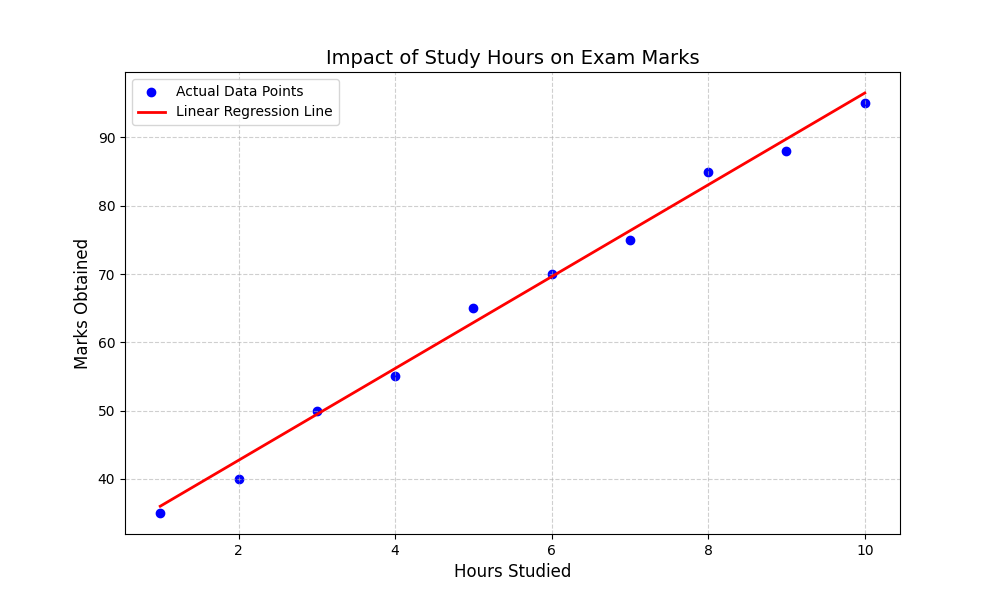

# Student Performance Predictor (Linear Regression)

This repository contains a simple Machine Learning model built using **Scikit-Learn** to predict student marks based on the number of hours studied.

## 📊 Results
- **Model:** Linear Regression
- **MSE:** 5.27
- **Prediction Formula:** Marks = 6.72 * (Hours) + 29.27

## 🛠️ Tech Stack
- Python (Pandas, Matplotlib)
- Scikit-Learn (Linear Regression)

